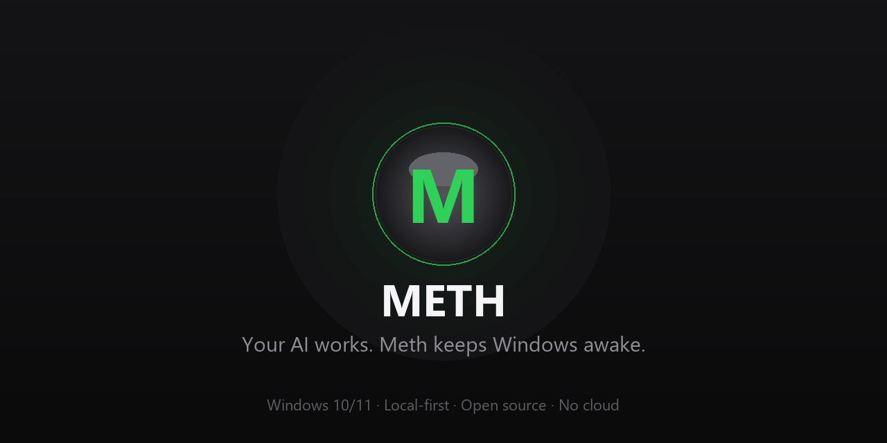
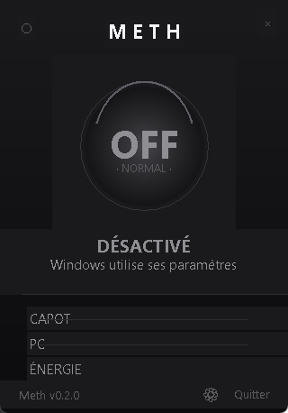
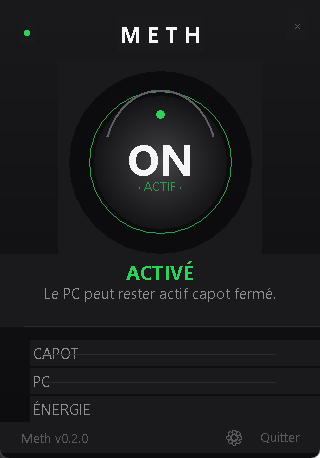

<p align="center">
  
</p>

<h1 align="center">Meth</h1>

<p align="center">
  <b>Le plugin qui fait que votre IA ne dort jamais tant qu'elle a du boulot.</b>
</p>

<p align="center">
  
  
  
</p>

---

Votre IA travaille.

Windows veut dormir.

**Meth dit non.**

Fermez votre PC portable. L'écran s'éteint. Le PC reste actif. Votre IA
continue de travailler.

---

## ✨ Captures d'écran

| Meth OFF | Meth ON (halo pulsant) |
|:---:|:---:|
|  |  |

Votre IA travaille.

Windows veut dormir.

Meth dit non.

Fermez votre PC portable.

L'écran s'éteint.

Le PC reste actif.

Votre IA continue de travailler.

---

## Pourquoi ?

Les agents IA peuvent travailler pendant des heures. Windows peut mettre un
portable en veille lorsque le capot est fermé — tuant votre compilation,
votre agent, votre téléchargement ou votre serveur.

Meth garde Windows actif tant que votre travail tourne. Un bouton. Pas de
compte. Pas de cloud. Pas d'administrateur. Aucun hack de souris.

## Comment ça marche

```
Capot fermé
    ↓
Écran éteint
    ↓
Le PC reste actif
    ↓
L'IA continue
```

Meth utilise l'API d'alimentation **native** de la plateforme pour demander
au système de rester éveillé. L'écran n'est **pas** maintenu allumé — il
s'éteint normalement. Rien n'est simulé, aucune saisie n'est truquée, aucun
paramètre n'est modifié définitivement.

### Windows

`SetThreadExecutionState` avec `ES_SYSTEM_REQUIRED` + `ES_CONTINUOUS`.

### Linux

`systemd-inhibit --what=sleep:handle-lid-switch --mode=block` : la veille ET
l'action fermeture du capot sont inhibées — capot fermé, écran éteint, tout
continue de tourner. **Fail-safe natif** : systemd relâche l'inhibiteur dès
que Meth meurt ou est arrêté — le PC ne peut jamais rester bloqué éveillé.
Sans `systemd` → refus honnête, jamais de keep-alive simulé.

> macOS n'est pas supporté : Meth s'y comporte honnêtement (le keep-alive y
> est indisponible, jamais prétendu).

## Fonctionnalités

- **Un gros bouton ON/OFF** — la seule chose à comprendre.
- **System Tray** — fermez la fenêtre et Meth continue en arrière-plan.
  Quitter depuis le tray arrête réellement Meth.
- **Statut honnête** — capot (ouvert/fermé/inconnu), alimentation
  (secteur/batterie/inconnue), jamais inventé.
- **Keep-alive natif** — `SetThreadExecutionState`, l'API Windows
  documentée. Fonctionne avec OpenCode, Pi, FreeBuff, les LLM locaux,
  Docker, Python, scripts, compilations, téléchargements — tout.
- **Fail-safe par conception** — Windows efface automatiquement l'état
  d'exécution quand le processus Meth se termine ou plante. À l'arrêt, Meth
  restaure aussi explicitement le comportement précédent.
- **Ultra léger** — événementiel, ~45 Mo de RAM (exe packagé) / ~30 Mo
  (depuis les sources), zéro réseau, CPU quasi nul au repos.
- **Local-first** — pas de compte, pas de cloud, pas de télémétrie, pas
  d'Internet nécessaire.

## Installation

### Prérequis

- Windows 10 ou Windows 11 (64 bits)
- Python 3.11+ (uniquement pour lancer depuis les sources)

### Option A — Depuis les sources

```bat
git clone https://github.com/votrenom/Meth.git
cd Meth
pip install -r requirements.txt
python run.py
```

### Option B — Portable (recommandé)

Téléchargez `Meth-Portable.zip` depuis la page
[Releases](https://github.com/votrenom/Meth/releases), décompressez où vous
voulez, double-cliquez sur `Meth.exe`. Pas d'installation, pas de Python.

### Option C — Installateur

Exécutez `Meth-Setup.exe` depuis la page Releases. Meth est installé pour
l'utilisateur courant et peut démarrer automatiquement avec Windows
(réglage optionnel).

## Utilisation

1. Lancez Meth (`python run.py`, ou `python run.py --tray` pour démarrer
   silencieux dans le tray).
2. Cliquez sur **ON**.
3. Fermez le portable. L'écran s'éteint, le PC reste actif, votre travail
   continue.
4. Rouvrez le portable quand c'est fini. Cliquez sur **OFF** pour restaurer
   le comportement normal.

Sur Linux : `pip install -r requirements.txt` (il faut `python3-tk` pour la
fenêtre). Config dans `~/.config/meth/config.json` ; autostart dans
`~/.config/autostart/meth.desktop`.

Fermer la fenêtre cache Meth dans le system tray — il continue de
fonctionner. Utilisez **Quitter** dans le menu du tray pour arrêter Meth
complètement.

## Sécurité

- **Privilèges minimum** — Meth ne demande jamais les droits administrateur.
- **Aucune modification permanente** — tant que Meth est ON, il demande à
  Windows de rester éveillé ; en OFF, il restaure le comportement précédent.
- **Fail-safe** — si Meth plante ou si Windows redémarre, le système revient
  automatiquement à son comportement d'alimentation normal (Windows efface
  l'état d'exécution à la mort du processus).
- **Aucun hack matériel** — ventilateurs, throttling et protections
  thermiques ne sont jamais touchés. Meth demande seulement à Windows de
  rester actif.
- **Aucune saisie simulée** — pas de mouvements de souris synthétiques, de
  pressions de touches ou de clics.
- **Avertissement batterie** — garder le PC actif capot fermé augmente la
  consommation et la température. Privilégiez le secteur pour les longues
  tâches.

Voir [SECURITY.md](SECURITY.md) pour le détail.

## Architecture

```
             UI (MainWindow + Tray + Settings)
                        ↓
                    Meth Core (KeepAlive)
                        ↓
                 src/backends (dispatcher)
                   ↙               ↘
        Windows (ctypes)     Linux (systemd/sysfs)
```

- `src/Core/` — le moteur keep-alive (état, activation, fail-safe, logs).
- `src/backends.py` — le dispatcher de plateforme : Windows / Linux / autre
  (repli honnête — jamais de faux keep-alive sur macOS/BSD).
- `src/Windows/` — la couche native Windows : `Power`, `Lid`, `System`
  (`SetThreadExecutionState`, registre).
- `src/Linux/` — la couche native Linux : `Power` (sysfs), `Lid` (ACPI),
  `System` (`systemd-inhibit`, autostart `.desktop`).
- `src/UI/` — la fenêtre compacte, le system tray, les paramètres.
- `src/Config/` — paramètres JSON dans `%APPDATA%\Meth\config.json`
  (Windows) ou `~/.config/meth/config.json` (Linux).

L'UI est entièrement séparée du Core et des backends, chaque couche est
testable isolément (la suite mocke l'API native, 91 tests sur Windows ET
Linux).

## Feuille de route

- **v0.1** ✅ — mini UI, ON/OFF, system tray, keep-alive, détection capot,
  restauration, Windows 10/11, tests, installateur.
- **v0.2** ✅ — **support Linux** (systemd-inhibit, sysfs, ACPI,
  autostart, config XDG), dispatcher de plateformes (`src/backends.py`),
  repli honnête (pas de macOS), UI métal mat style Apple.
- **v0.3** — sessions & heartbeat (une IA peut déclarer « je travaille
  encore »), profils, comportement batterie (arrêt auto sur batterie
  faible).
- **v1.0** — sessions avancées, heartbeat, API, CLI, déclencheurs.
- **v2.0** — intégrations (OpenCode, Pi, FreeBuff), SDK, automatisations.

## Contribuer

Voir [CONTRIBUTING.md](CONTRIBUTING.md) et notre
[Code de Conduite](CODE_OF_CONDUCT.md).

## Licence

[MIT](LICENSE)

---

> **Meth.** *Votre IA travaille. Meth garde Windows éveillé.*
